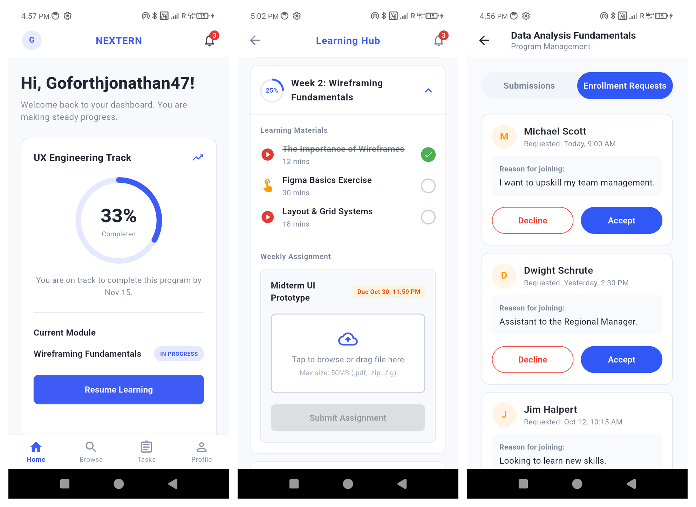
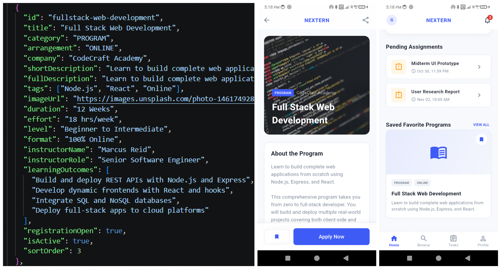
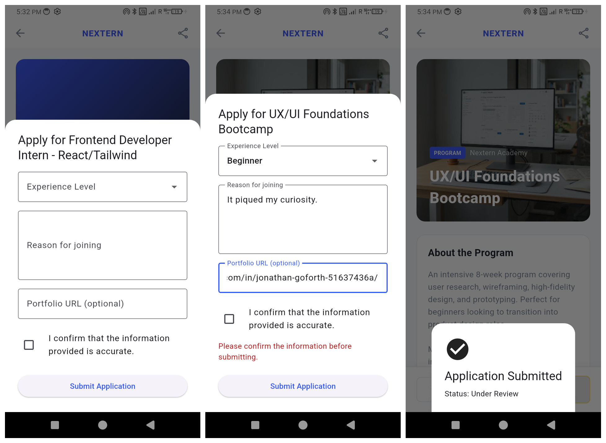

<div align="center">

# Nextern

### Learning programs, applications, progress, and administration in one Flutter app

[](https://github.com/Jonathan-Go4th/Project-Nextern/actions/workflows/flutter-ci.yml)
[](https://github.com/Jonathan-Go4th/Project-Nextern/releases)
[](test)
[](LICENSE)

[Download Android APK](https://github.com/Jonathan-Go4th/Project-Nextern/releases/download/v1.0.0/Nextern-v1.0.0-android-universal.apk)
·
[Watch Demo](https://drive.google.com/file/d/1h6qsRaYFGqBf4dTSosTcI3IorAMZbxYi/view)
·
[View Figma Design](https://www.figma.com/design/zFOUI2k38kZSWLhMXAM1sV/Nextern-App?node-id=92-55&t=Xy7SYgtqdB2bLa33-0)

</div>

---

## Overview

Nextern is a Flutter application that connects learners with structured learning programs and internships while providing administrators with tools to manage programs, learners, applications, assignments, announcements, and progress.

The application includes separate learner and administrator experiences with shared program data, persistent local state, validated application workflows, and consistent navigation across the main screens.

Version `1.0.0+4` is the first complete open-source release.



## Highlights

### Learner experience

- Create an account, sign in, recover a password, or enter through the administrator login route.
- Browse learning programs and internships using search, categories, filters, and pagination.
- View complete program information, learning outcomes, schedules, instructors, and requirements.
- Save programs and retain saved choices between app sessions.
- Submit validated program applications and monitor enrolment status.
- Resume active programs and track progress through weekly learning content.
- View tasks, submit assignments, monitor submission status, and access certificates.
- Manage profile information, notifications, security settings, feedback, and support.

### Administrator experience

- View learner totals, program activity, submissions, announcements, and recent events.
- Create, edit, search, and manage programs and learning modules.
- Review learner applications and accept or decline enrolment requests.
- Review submissions, attachments, results, and assignment status.
- Search and manage learner accounts, profiles, enrolments, and risk indicators.
- Publish announcements that appear within the learner experience.
- Manage administrator profile, preferences, security, and two-factor settings.

## Screenshots

### Learner interface


### Program data and saved programs



### Application workflow



### Administrator interface


## Android installation

The v1.0.0 release provides a universal Android APK:

**[`Nextern-v1.0.0-android-universal.apk`](https://github.com/Jonathan-Go4th/Project-Nextern/releases/download/v1.0.0/Nextern-v1.0.0-android-universal.apk)**

To install it:

1. Download the APK from the GitHub release.
2. Open the downloaded file on an Android device.
3. Permit installation from the browser or file manager when Android requests it.
4. Complete the installation and open Nextern.

Android is the primary packaged target for v1.0.0. Other Flutter platform directories are retained for continued development but are not included as release binaries.

## Development setup

### Requirements

- Git
- Flutter stable with Dart 3.12.2 or newer
- Android Studio or another Flutter-compatible editor
- Android SDK and an emulator or physical Android device

### Clone and run

```bash
git clone https://github.com/Jonathan-Go4th/Project-Nextern.git
cd Project-Nextern
flutter pub get
flutter run
```

Check the Flutter environment when setup problems occur:

```bash
flutter doctor
```

## Quality checks

Run the same analysis and tests used by GitHub Actions:

```bash
flutter analyze --no-fatal-infos
flutter test
```

The v1.0.0 release passes all 24 automated tests. Informational Flutter recommendations are reported, while analyzer warnings and errors continue to fail CI.

## Build the Android APK

```bash
flutter clean
flutter pub get
flutter build apk --release
```

The generated universal APK is written to:

```text
build/app/outputs/flutter-apk/app-release.apk
```

For the official release, this file is distributed as:

```text
Nextern-v1.0.0-android-universal.apk
```

## Data and architecture

Nextern currently uses a local-first application architecture:

```text
assets/data/programs.json
        │
        ▼
  ProgramService
        │
        ▼
    ProgramStore
        │
        ├── Browse
        ├── Home
        └── Program Details

SharedPreferences
        │
        ├── Saved programs
        └── Local session state
```

Core implementation areas include:

- Models for structured application data.
- Services for loading programs, saved items, applications, sessions, and announcements.
- Shared state implemented with `ChangeNotifier`.
- Local JSON assets acting as the current program-data source.
- `SharedPreferences` for selected persistent state.
- Reusable widgets for forms, navigation, notifications, certificates, and dialogs.
- Separate learner and administrator screen workflows.

The service and state layers are structured so that the local data source can later be replaced by a remote backend.

> Nextern v1.0.0 is a demonstrable learning-platform application. Its current authentication, program data, and workflow state are primarily local and should not be treated as a production backend or production identity system.

## Repository structure

```text
.github/
├── ISSUE_TEMPLATE/
└── workflows/

assets/
└── data/

docs/
├── images/
└── PROJECT_HISTORY.md

lib/
├── models/
├── screens/
├── services/
├── stores/
├── widgets/
└── main.dart

test/
```

## Project documentation

- [Changelog](CHANGELOG.md)
- [Development history](docs/PROJECT_HISTORY.md)
- [Contributing guide](CONTRIBUTING.md)
- [Security policy](SECURITY.md)
- [Code of conduct](CODE_OF_CONDUCT.md)
- [MIT licence](LICENSE)
- [Week 3 development documentation](Nextern_Week_3_Development_Documentation.pdf)
- [App proposal](Nextern%20-%20App%20Proposal.pdf)
- [Week 2 deliverables](Nextern%20-%20Deliverables%20Week%202.pdf)

## Contributing

Contributions are welcome.

Before submitting a change:

1. Read [CONTRIBUTING.md](CONTRIBUTING.md).
2. Create a focused branch.
3. Run Flutter analysis and tests.
4. Open a pull request using the repository template.

Security vulnerabilities should be reported privately according to [SECURITY.md](SECURITY.md), not through a public issue.

## Team 18

| Contributor | Primary contributions |
|---|---|
| Jonathan Goforth | Dynamic program data, saved programs, repository management, video editing, and deliverables documentation |
| Renz Paulo Baltazar | Figma wireframes, UI/UX design, and cross-application workflow expansion |
| Favour Chigemezu Uzochukwu | Program application form and enrolment submission workflow |
| Sadaf | Merged-code quality assurance |

## Licence

Nextern is released under the [MIT Licence](LICENSE).

---

<div align="center">

Built with Flutter by Team 18.

</div>
